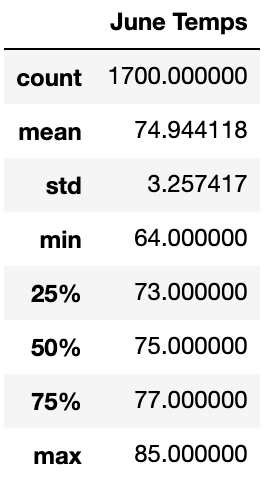
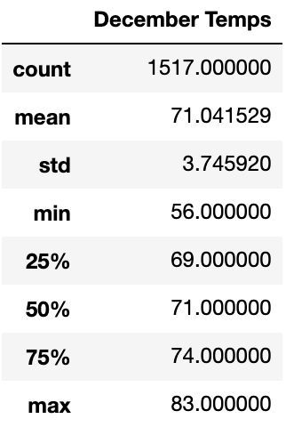

# Surf's Up Analysis

## Overview of Project
The focus of this project is to provide investor W. Avy with an analysis of weather data to persuade him to invest in my Surf n' Shake shop on the island of Oahu. For this challenge, I am focusing specifically on the months of June and December to determine if the shop is sustainable year round. To do so, I have gathered summary statistics of weather data for June and December to assist W. Avy in making his investment decision.

## Results
After conducting this analysis, I have gathered the following results:
- The average temperature is 74.9 degrees in June and 71.0 in December
- The minimum temperature is 64 in June and 56 in December
- The maximum temperature is 85 in June and 83 in December
The full summary statistics for both June and December are shown below.

## Summary
Because there is little variance between the temperatures in June and December, it is safe to assume the rest of the year will follow a similar pattern. With an average temperature of around 70-75 degrees, we can conclude that it will be warm enough for the Surf n' Shake shop to be sustainable year round. To gather additional information on the weather in June and December, we can run queries to get statistics on the precipation. This will be helpful to ensure that there is an ideal amount of rain on the island year round.

The queries below will gather precipation data for June and December, respectively: 
- session.query(Measurement.date, Measurement.prcp).filter(extract('month', Measurement.date)==6).all()
- session.query(Measurement.date, Measurement.prcp).filter(extract('month', Measurement.date)==12).all()
